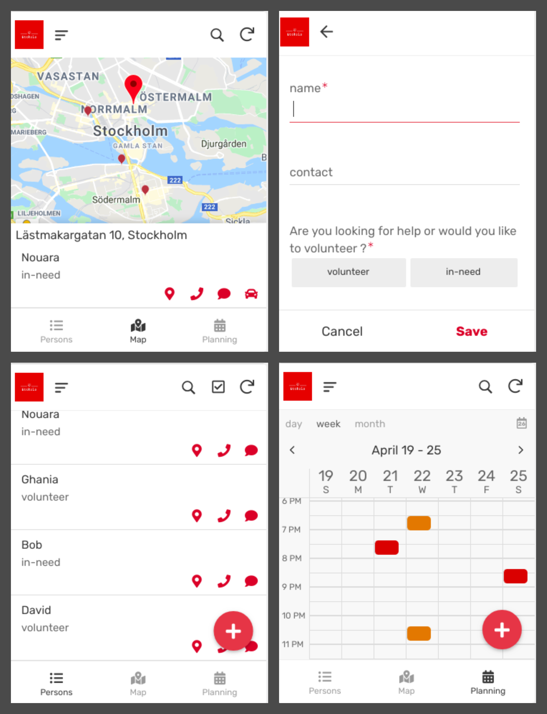

# bookala
Non-profit mobile app to match isolated help seekers with volunteers to deliver groceries and first-necessity products during times of COVID-19 confinement.

Submited for the [#EUvsVirus](https://euvsvirus.org/) hackathon from the 24th to the 26th of April 2020.

## Table of Contents
1. [The problem your project solves](#The-problem-your-project-solves)
2. [The solution you bring to the table](#The-solution-you-bring-to-the-table)
3. [What you have done during the weekend](#What-you-have-done-during-the-weekend)
4. [The solution’s impact to the crisis](#The-solution’s-impact-to-the-crisis)
5. [The necessities in order to continue the project](#The-necessities-in-order-to-continue-the-project)
6. [The value of your solution after the crisis](#The-value-of-your-solution-after-the-crisis)
7. [The URL to the prototype](#The-URL-to-the-prototype)
8. [The URL to the pitchvideo](#The-URL-to-the-pitchvideo)

## The problem your project solves

We all know somebody who is vulnerable and who is isolated at home by fear of catching an infection to the virus. These persons already have long-term respiratory illnesses, or have a weak immune system that cannot fight the COVID-19 infection.

Because of this, they must stay at home for a long period of time, and thus they need support from family and friends to get their groceries and first-necessity products from stores. But what if they don't have any family and relatives living nearby? Or what if nobody is available to help them out?

Ordering food online or getting pizza deliveries cannot be a sustainable solution for the long run, so let's try to find a solution.

## The solution you bring to the table

We propose a simple and reliable platform where isolated persons can post their needs, and where volunteers can raise their hands to help out. The solution targets the following categories:
- Elderly and vulnerable people
- People with a suspected or confirmed infection who are secluded at home
- Persons with limited mobility

This platform comes as a mobile application with a minimalist and intuitive interface composed of 4 main panels:

- A sign-in form (volunteer or in-need persons).
- A list of volunteers nearby (or in-need persons in case you want to help), with the possibility to call or message them.
- A map with the location of each person nearby.
- A calendar with future deliveries you booked, or your future tasks if you are a volunteer.

#### What we used to build the solution

We used [AppSheet](https://www.appsheet.com/) to develop a rapid prototype, and we based it on [a simple spreadsheet](https://docs.google.com/spreadsheets/d/1qMrc85cjZ-oLDLtZIKaMewh9iG_w5ZvHvZ0MRMwBomc/edit?usp=sharing) to store and fetch the users' data.

We used [RenderForest](https://www.renderforest.com/) to make the video description below.

#### Benefits of the solution
- Solves a huge problem met by the vulnerable and isolated persons on a regular basis.
- Massively scalable
- Easy to use
- Non-profit
- Cheap to setup and deploy

## What you have done during the weekend

- We have fine-tuned our idea.
- We have organized a game plan.
- We have talked to domain experts and gathered feedback from them.
- We have split the work among our team, and organized regular checkpoints to see who needed help and who made proud achievements. Work. Eat. Repeat.
- ... and most importantly we had so much fun, and we learned a loooot.

## The solution’s impact to the crisis

This massively scalable application has the following benefits:

- Protect persons at risk by providing them solution to stay at home while having regular supplies of groceries and first-necessity products.

- Keep the economy of local area markets flowing by maintaining the levels of demand and supply of groceries and goods.

- Encourage volunteering and develop a sens of solidarity in local communities.

## The necessities in order to continue the project

In order to deploy the application to the public, we need to migrate it from a prototyping to a production environment.

We also want to add the possibility to or transfer money from one person to another once the goods are delivered - From the requester to the volunteer.

## The value of your solution after the crisis

Once the storm passed, this application can continue to be used by persons with limited mobility, and who are in frequent need of help with groceries and first-necessity products.

## The URL to the prototype

The app prototype can be via the AppSheet emulator via [this link](https://www.appsheet.com/newshortcut/3bfd6867-37e2-4d55-8306-e5ac1a5a0265).

(If the above link doesn't work, please copy-paste this link into a browser on your phone: https://www.appsheet.com/newshortcut/3bfd6867-37e2-4d55-8306-e5ac1a5a0265)

Please note that it is not possible to open the app via a browser on desktop/laptop. It can only be tested via a mobile phone.

## The URL to the pitchvideo

